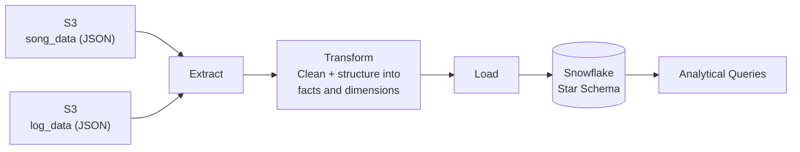

<h1 align="center">🎵 Sparkify Data Warehousing Project</h1>
This project focuses on building a scalable data warehouse using Snowflake for Sparkify, a fictional music streaming startup. The goal is to design an optimized star schema, perform ETL operations, and enable efficient analytical queries on user activity and song metadata.

<p align="center">
  
  
  
  
  
</p>

<p align="center">
  A cloud data warehouse built on <b>Snowflake</b> for Sparkify, a fictional music
  streaming startup. Raw song and user-activity logs are extracted from S3, transformed,
  and loaded into an optimized <b>star schema</b> that powers fast analytical queries
  on what users are listening to.
</p>

<p align="center">
  
  
  
</p>

---

## 📖 Table of Contents

- [Overview](#-overview)
- [Architecture](#-architecture)
- [Project Structure](#-project-structure)
- [Datasets](#-datasets-description)
- [Data Model (Star Schema)](#-data-model-star-schema)
- [ETL Workflow](#-etl-workflow-summary)
- [Tech Stack](#-tech-stack)
- [Getting Started](#-getting-started)
- [Learning Objectives](#-learning-objectives)

---

## 📌 Overview

Sparkify wants to understand what songs their users are listening to. The raw data
lives as JSON logs in S3 — one set describing songs and artists, another describing
user listening activity — and isn't easy to query directly. This project builds an
ETL pipeline that lands both datasets in Snowflake and reshapes them into a **star
schema**, so the analytics team can run simple, fast SQL queries instead of parsing
JSON by hand.

## 🏗️ Architecture

<p align="center">
  
</p>



<p align="center">
  
</p>

## 📁 Project Structure

```
Sparkify-data-warehousing/
│
├── README.md                 # Project documentation
├── images/                   # Architecture and schema diagrams
│   ├── architecture.PNG
│   └── schema.PNG
└── data/
    ├── log_data/              # User activity event logs (JSON)
    │   ├── 2018-11-01-events.json
    │   ├── 2018-11-02-events.json
    │   └── ...
    └── song_data/             # Song metadata (JSON)
        └── A/
            ├── A/
            └── B/
```

## 🎶 Datasets Description

The project uses two JSON datasets — **Song Data** and **Log Data (Events)** — which
simulate real activity from the Sparkify app.

### 1. Song Data

Each file contains metadata about a single song and its artist.

**Example Structure:**
```json
{
  "num_songs": 1,
  "artist_id": "ARJIE2Y1187B994AB7",
  "artist_latitude": null,
  "artist_longitude": null,
  "artist_location": "",
  "artist_name": "Line Renaud",
  "song_id": "SOUPIRU12A6D4FA1E1",
  "title": "Der Kleine Dompfaff",
  "duration": 152.92036,
  "year": 0
}
```

**Key Fields:**

| Field | Description |
|---|---|
| `song_id` | Unique song identifier |
| `title` | Song title |
| `artist_id` | Foreign key reference to artist |
| `artist_name` | Artist name |
| `year` | Song release year |
| `duration` | Song duration in seconds |

### 2. Log Data (Event Data)

Contains user activity logs (e.g., songs played, user sessions).

**Example Structure:**
```json
{
  "artist": "Pavement",
  "auth": "Logged In",
  "firstName": "Sylvie",
  "gender": "F",
  "itemInSession": 0,
  "lastName": "Cruz",
  "length": 99.16036,
  "level": "free",
  "location": "Washington-Arlington-Alexandria, DC-VA-MD-WV",
  "method": "PUT",
  "page": "NextSong",
  "registration": 1540266185796.0,
  "sessionId": 345,
  "song": "Mercy:The Laundromat",
  "status": 200,
  "ts": 1541990258796,
  "userAgent": "\"Mozilla/5.0 ...\"",
  "userId": "10"
}
```

**Key Fields:**

| Field | Description |
|---|---|
| `userId` | Unique user ID |
| `firstName`, `lastName`, `gender` | User details |
| `level` | User subscription level (free/paid) |
| `song`, `artist`, `length` | Song being played |
| `sessionId` | Session ID for the event |
| `location` | User location |
| `ts` | Timestamp (in milliseconds) |

## 🧩 Data Model (Star Schema)

The warehouse schema is designed as a **star schema** optimized for song-play analysis.

<p align="center">
  
  
</p>

### Fact Table
- **`songplays`** — records in log data associated with song plays.

### Dimension Tables
- **`users`** — users of the Sparkify app.
- **`songs`** — songs in the music database.
- **`artists`** — artists who performed the songs.
- **`time`** — timestamps of records broken down into units (hour, day, week, etc.).

## ⚙️ ETL Workflow Summary

| Step | Description |
|---|---|
| **1. Extract** | Data is read from S3 buckets (`song_data`, `log_data`). |
| **2. Transform** | JSON data is cleaned and structured into fact and dimension tables. |
| **3. Load** | Data is inserted into Snowflake tables for analytics. |

## 🛠️ Tech Stack

| Layer | Technology |
|---|---|
| Data Warehouse | Snowflake |
| Raw Storage | Amazon S3 |
| Language | Python 3 |
| Data Format | JSON |
| Query Language | SQL |

## 🚀 Getting Started

1. **Configure access** — set up AWS credentials with read access to the `song_data` and `log_data` S3 buckets, plus a Snowflake account/warehouse for loading.
2. **Create the schema** — run the DDL to create the `songplays` fact table and the `users`, `songs`, `artists`, and `time` dimension tables in Snowflake.
3. **Run the ETL** — extract JSON from S3, transform it into the star schema shape, and load it into Snowflake.
4. **Query** — use the star schema to answer questions like "what songs are free-tier users playing most" with simple joins instead of parsing raw JSON.

## 🎯 Learning Objectives

- Build a cloud-based data warehouse using **Snowflake**.
- Design an optimized **star schema** for analytical queries.
- Understand **data modeling** and **metadata management** in cloud environments.

---

<p align="center">
  <sub>Built with Snowflake, AWS S3, Python</sub>
</p>

