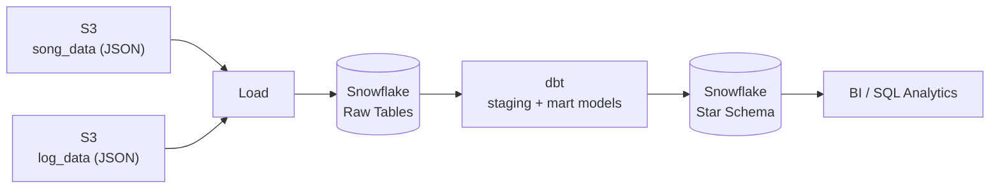

<p align="center">
  
  
  
  
  
</p>

<h1 align="center">Sparkify Data Warehousing Project</h1>

<p align="center">
  A production-style cloud data warehouse built on <b>Snowflake</b> for Sparkify, a
  fictional music streaming company. Raw song catalog and user-activity event data is
  ingested from <b>Amazon S3</b>, loaded into Snowflake, and modeled with <b>dbt</b>
  into an analytics-ready star schema for song-play reporting.
</p>

<p align="center">
  
  
  
  
</p>

---

## Table of Contents

- [Overview](#overview)
- [Architecture](#architecture)
- [Data Model](#data-model)
- [Datasets](#datasets)
- [Project Structure](#project-structure)
- [Tech Stack](#tech-stack)
- [Getting Started](#getting-started)
- [dbt Workflow](#dbt-workflow)
- [Data Quality & Testing](#data-quality--testing)
- [Roadmap](#roadmap)
- [License](#license)

---

## Overview

Sparkify's analytics team needs to understand what songs users are listening to, but
the source data is scattered across raw JSON event logs and song metadata files in S3
— not something analysts can query directly. This project implements a cloud-native
**ELT pipeline** that:

1. Lands raw JSON from S3 into Snowflake staging tables.
2. Uses **dbt** to transform and model that data into a well-tested, documented **star
   schema**.
3. Exposes a single fact table and four dimension tables that support fast, simple SQL
   for song-play analytics (e.g., most-played songs, active users by subscription
   tier, peak listening hours).

## Architecture

<p align="center">
  
  
</p>
  <br>
  <sub>End-to-end pipeline: S3 → Snowflake (raw) → dbt (transform) → Snowflake (star schema) → analytics</sub>
</p>



**Pipeline stages**

| Stage | Description |
|---|---|
| **Extract** | Song metadata and user-activity event logs are read from S3 buckets. |
| **Load** | Raw JSON is loaded as-is into Snowflake staging tables. |
| **Transform** | dbt models clean, conform, and join the raw data into fact and dimension tables. |
| **Serve** | The resulting star schema is queried directly by analysts or BI tools. |

## Data Model

The warehouse is modeled as a **star schema** optimized for song-play analysis: one
fact table at the center, surrounded by four dimension tables.

<p align="center">
 
  <br>
  <sub>songplays (fact) linked to users, songs, artists, and time (dimensions)</sub>
</p>

| Table | Type | Grain | Description |
|---|---|---|---|
| `songplays` | Fact | One row per song-play event | Central table linking every play to a user, song, artist, and timestamp. |
| `users` | Dimension | One row per user | Sparkify app users — name, gender, subscription level. |
| `songs` | Dimension | One row per song | Song catalog — title, artist reference, year, duration. |
| `artists` | Dimension | One row per artist | Artist metadata — name and location. |
| `time` | Dimension | One row per timestamp | Timestamps broken into hour, day, week, month, year, weekday for time-based analysis. |

## Datasets

The project uses two JSON datasets that simulate real activity from the Sparkify app.

### Song Data

One file per song, containing metadata about the song and its artist.

```json
{
  "num_songs": 1,
  "artist_id": "ARJIE2Y1187B994AB7",
  "artist_latitude": null,
  "artist_longitude": null,
  "artist_location": "",
  "artist_name": "Line Renaud",
  "song_id": "SOUPIRU12A6D4FA1E1",
  "title": "Der Kleine Dompfaff",
  "duration": 152.92036,
  "year": 0
}
```

| Field | Description |
|---|---|
| `song_id` | Unique song identifier |
| `title` | Song title |
| `artist_id` | Foreign key reference to artist |
| `artist_name` | Artist name |
| `year` | Song release year |
| `duration` | Song duration in seconds |

### Log Data (Events)

User activity logs — songs played, sessions, authentication events.

```json
{
  "artist": "Pavement",
  "auth": "Logged In",
  "firstName": "Sylvie",
  "gender": "F",
  "itemInSession": 0,
  "lastName": "Cruz",
  "length": 99.16036,
  "level": "free",
  "location": "Washington-Arlington-Alexandria, DC-VA-MD-WV",
  "method": "PUT",
  "page": "NextSong",
  "registration": 1540266185796.0,
  "sessionId": 345,
  "song": "Mercy:The Laundromat",
  "status": 200,
  "ts": 1541990258796,
  "userAgent": "\"Mozilla/5.0 ...\"",
  "userId": "10"
}
```

| Field | Description |
|---|---|
| `userId` | Unique user ID |
| `firstName`, `lastName`, `gender` | User details |
| `level` | Subscription level (free/paid) |
| `song`, `artist`, `length` | Song being played |
| `sessionId` | Session ID for the event |
| `location` | User location |
| `ts` | Event timestamp (milliseconds) |

## Project Structure

```
Sparkify-data-warehousing/
│
├── README.md                      # Project documentation
├── images/                        # Architecture and schema diagrams
│   ├── architecture.PNG
│   └── schema.PNG
│
├── data/
│   ├── log_data/                  # User activity event logs (JSON)
│   │   ├── 2018-11-01-events.json
│   │   ├── 2018-11-02-events.json
│   │   └── ...
│   └── song_data/                 # Song metadata (JSON)
│       └── A/
│           ├── A/
│           └── B/
│
└── dbt/                            # dbt project
    ├── dbt_project.yml
    ├── packages.yml
    ├── profiles.yml.example
    ├── models/
    │   ├── staging/                # 1:1 with raw sources, light cleaning
    │   │   ├── stg_songs.sql
    │   │   ├── stg_events.sql
    │   │   └── sources.yml
    │   └── marts/                  # Star schema — facts and dimensions
    │       ├── fct_songplays.sql
    │       ├── dim_users.sql
    │       ├── dim_songs.sql
    │       ├── dim_artists.sql
    │       ├── dim_time.sql
    │       └── schema.yml          # Tests + documentation
    ├── tests/                       # Custom singular tests
    └── macros/                      # Reusable Jinja macros
```

## Tech Stack

| Layer | Technology |
|---|---|
| Data Warehouse | Snowflake |
| Raw Storage | Amazon S3 |
| Transformation | dbt (Data Build Tool) |
| Data Format | JSON |
| Query Language | SQL |
| Version Control | Git |

## Getting Started

### Prerequisites

- A Snowflake account with a warehouse, database, and schema provisioned
- AWS credentials with read access to the `song_data` and `log_data` S3 buckets
- `dbt-snowflake` installed (`pip install dbt-snowflake`)

### Setup

```bash
# 1. Clone the repository
git clone https://github.com/<your-org>/Sparkify-data-warehousing.git
cd Sparkify-data-warehousing/dbt

# 2. Install dbt dependencies (if using packages.yml)
dbt deps

# 3. Configure your Snowflake connection
cp profiles.yml.example ~/.dbt/profiles.yml
# edit ~/.dbt/profiles.yml with your account, warehouse, database, schema, and credentials

# 4. Load raw JSON from S3 into Snowflake staging tables
# (via COPY INTO / an external stage, or Snowpipe — see /sql if included)

# 5. Test the connection
dbt debug
```

## dbt Workflow

```bash
# Run all models (staging -> marts)
dbt run

# Run only the star schema mart models
dbt run --select marts

# Run data quality tests (not_null, unique, relationships, etc.)
dbt test

# Generate and view interactive documentation
dbt docs generate
dbt docs serve
```

Once `dbt run` completes, the `songplays` fact table and the `users`, `songs`,
`artists`, and `time` dimension tables are available in Snowflake and ready to query:

```sql
select
    u.level,
    count(*) as plays
from fct_songplays sp
join dim_users u using (user_id)
group by u.level
order by plays desc;
```

## Data Quality & Testing

dbt tests are defined in `models/marts/schema.yml` and enforced on every run:

| Test type | Applied to |
|---|---|
| `unique` | Primary keys — `songplay_id`, `user_id`, `song_id`, `artist_id`, `start_time` |
| `not_null` | Primary and foreign keys across all fact/dimension tables |
| `relationships` | Foreign keys in `fct_songplays` reference valid dimension rows |
| `accepted_values` | `users.level` restricted to `free` / `paid` |

## Roadmap

- [ ] Automate S3 → Snowflake loading with S3 Storage integration (ingestion)
- [ ] Add incremental dbt models for large event volumes
- [ ] Add CI (GitHub Actions) to run `dbt build` on every pull request
- [ ] Expose the star schema through a BI dashboard (e.g., Looker, Tableau, Streamlit)
---

<p align="center">
  <sub>Built with Snowflake · AWS S3 · dbt</sub>
</p>
